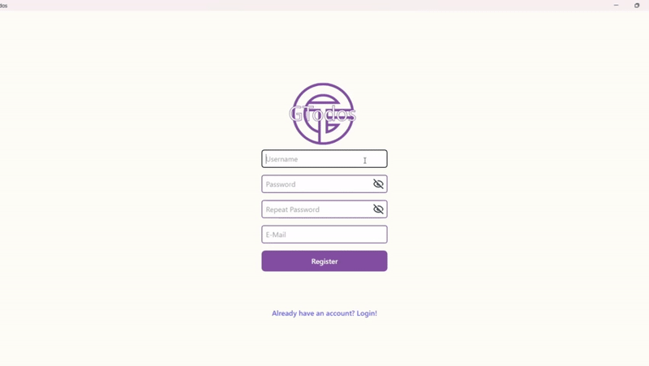
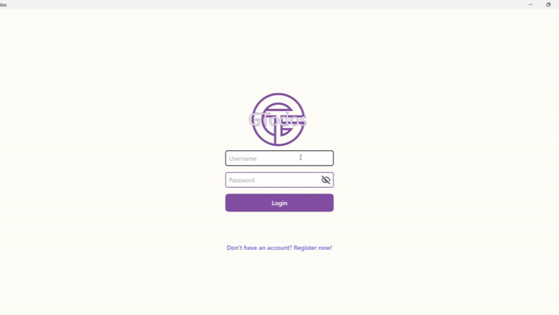
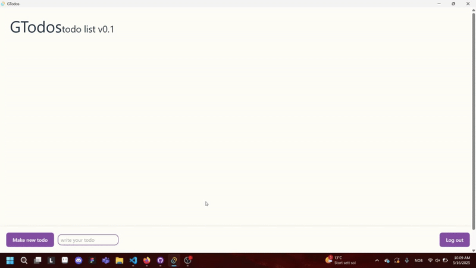
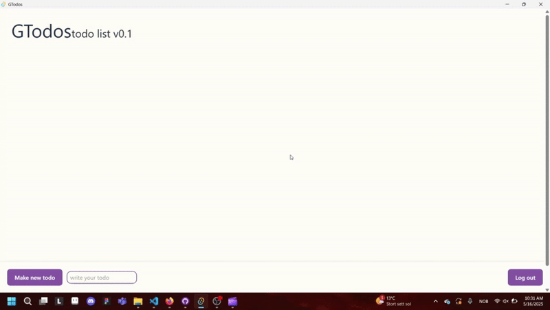

  

<h1 align="center">GTodos Todo App v0.1</h1>
<h3 align="center">Open sorce application for all your todos</h3>

 
 

  <h3>What is GTodos?</h3>
  
  ********
  
  
This project is a cross-platform desktop to-do application built with:

  
  *  Frontend: React + TypeScript (structured with Vite for fast builds and development), styled with custom CSS modules.
  
  *  Backend: Node.js + TypeScript with a REST API structure (Express or similar) for handling routes like todo and users.
    
  *  Database: MariaDB, used for persistent data storage.
    
  *  Desktop Environment: Tauri, for building lightweight and secure desktop apps with native performance.

 
 

  <h3>How to use GTodos</h3>

  ********

  Step 1. Register Account
  

    
  

  
   
  
  Step 2. Login
  

    
  

  
   
  
  Step 3. making, checking, editing and deleting todos
  

    
  

  
   
  
  Step 4. logout
  

    
  

  
  

